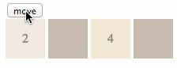

2028-Simulation
===============

A simulation for the 2024 game. The project includes an algorithm and animation simulation.

Implementation
--------------
Tiles are models with objects that have an original and future location. At the start, both the original and future locations are the same, which means that nothing will move by default. Then, we start iterating from the next to last column of the direction of movement (e.g. if we press right, then we start from the next to last column on the right). We don't care about the last column because it won't move, only other tiles are allowed to be placed on top of it if their numbers match.

In our iteration, we find the furthest possible location for a tile from its original place. If a match is found then we move the tile there and set its future location. Otherwise, we move to the next column. If a tile moves to make a match, then a flag is set on it to announce it as a blocking tile.

Blocking tiles don't allow other tiles from moving further. This concept insures that double matches on the same set of matches don't happen (e.g. if we had the following [4,0,2,2] and we press right, we should end up with [0,0,4,4] and not with [0,0,0,8]).

When we have finished iterating over all the columns, then we can devise a list of pairs of original and future locations. We use these pairs to feed into the animation mechanism. Animation starts with the same order of columns that the matching algorithm uses. A tile is moved to its new location using css transitions. The last tile that moves to a matching location, changes its value and colour to be the sum of the match, and the tiles underneath it will be hidden.

Demo
----
Starting with a [2,0,4,0], and right pressed. We don't expect any matching, just the tiles moving to far right

Starting with a [4,2,2,0], and right pressed. We expect 2's to match, but the left 4 to not match with the new formed 4

